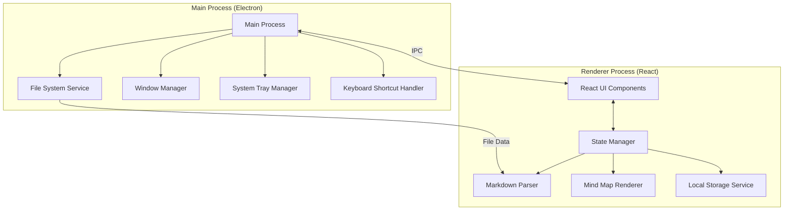

# Design Document

## Overview

The Markdown Mind Map Viewer is an Electron-based desktop application built with React, TypeScript, and Vite. The application reads Markdown files from a user-selected folder, parses their heading structure, and visualizes them as interactive mind maps. The architecture follows a clear separation between the Electron main process (file system operations, window management, system tray) and the renderer process (React UI, mind map visualization).

Key design principles:
- **Separation of concerns**: Main process handles system-level operations, renderer handles UI
- **State persistence**: User preferences and folder paths stored in local storage
- **Reactive UI**: React-based component architecture with state management
- **Extensible parsing**: Pluggable Markdown parser for flexibility
- **Performance**: Efficient rendering for large document hierarchies

## Architecture

### High-Level Architecture



### Process Communication

The application uses Electron's IPC (Inter-Process Communication) for communication between main and renderer processes:

- **Main → Renderer**: File system events, window state changes
- **Renderer → Main**: File system requests, window control commands, tray operations

### Component Layers

1. **Presentation Layer** (React Components)
   - HomePage: Folder selection interface
   - MindMapPage: Tab navigation and mind map display
   - Toolbar: Customizable toolbar component
   - ContentPopup: Modal for displaying leaf node content

2. **Business Logic Layer**
   - MarkdownParser: Parses MD files and extracts heading hierarchy
   - MindMapBuilder: Converts heading tree to mind map data structure
   - StateManager: Manages application state (React Context/Zustand)

3. **Service Layer**
   - FileSystemService: Handles file operations via IPC
   - StorageService: Manages localStorage persistence
   - KeyboardService: Registers and handles keyboard shortcuts

4. **Infrastructure Layer**
   - Electron Main Process: Window lifecycle, system integration
   - IPC Bridge: Type-safe communication between processes

## Components and Interfaces

### Main Process Components

#### FileSystemService

```typescript
interface FileSystemService {
  // Select folder using native dialog
  selectFolder(): Promise<string | null>;
  
  // Read all .md files from a folder
  readMarkdownFiles(folderPath: string): Promise<MarkdownFile[]>;
  
  // Read single file content
  readFileContent(filePath: string): Promise<string>;
  
  // Watch folder for changes
  watchFolder(folderPath: string, callback: (files: MarkdownFile[]) => void): void;
}

interface MarkdownFile {
  name: string;
  path: string;
  content: string;
}
```

#### WindowManager

```typescript
interface WindowManager {
  // Create and configure main window
  createWindow(config: WindowConfig): BrowserWindow;
  
  // Restore window from tray
  showWindow(): void;
  
  // Hide window to tray
  hideWindow(): void;
  
  // Save/restore window bounds
  saveWindowBounds(bounds: Rectangle): void;
  getWindowBounds(): Rectangle | null;
}

interface WindowConfig {
  width: number;
  height: number;
  minWidth: number;
  minHeight: number;
}
```

#### SystemTrayManager

```typescript
interface SystemTrayManager {
  // Create system tray icon
  createTray(): void;
  
  // Update tray menu
  updateMenu(items: TrayMenuItem[]): void;
  
  // Handle tray events
  onTrayClick(callback: () => void): void;
  onTrayRightClick(callback: () => void): void;
}

interface TrayMenuItem {
  label: string;
  click: () => void;
  type?: 'normal' | 'separator';
}
```

### Renderer Process Components

#### MarkdownParser

```typescript
interface MarkdownParser {
  // Parse markdown content into heading tree
  parse(content: string): HeadingNode;
}

interface HeadingNode {
  id: string;
  level: number; // 1-6 for H1-H6
  text: string;
  content: string; // Text content under this heading
  children: HeadingNode[];
  isLeaf: boolean;
}
```

#### MindMapRenderer

```typescript
interface MindMapRenderer {
  // Render mind map from heading tree
  render(root: HeadingNode, container: HTMLElement): void;
  
  // Handle node click events
  onNodeClick(callback: (node: HeadingNode) => void): void;
  
  // Update zoom and pan
  setZoom(level: number): void;
  setPan(x: number, y: number): void;
}

interface MindMapNode {
  id: string;
  label: string;
  x: number;
  y: number;
  children: MindMapNode[];
  data: HeadingNode;
}
```

#### StateManager (React Context)

```typescript
interface AppState {
  // Folder and files
  selectedFolder: string | null;
  markdownFiles: MarkdownFile[];
  
  // Tab management
  activeTabIndex: number;
  tabs: TabInfo[];
  
  // UI state
  toolbarVisible: boolean;
  toolbarPosition: 'top' | 'bottom' | 'left' | 'right';
  
  // Popup state
  popupVisible: boolean;
  popupContent: { heading: string; content: string } | null;
}

interface TabInfo {
  id: string;
  filename: string;
  headingTree: HeadingNode | null;
}

interface AppActions {
  setSelectedFolder(path: string): void;
  loadMarkdownFiles(files: MarkdownFile[]): void;
  setActiveTab(index: number): void;
  toggleToolbar(): void;
  setToolbarPosition(position: 'top' | 'bottom' | 'left' | 'right'): void;
  showPopup(heading: string, content: string): void;
  hidePopup(): void;
}
```

#### StorageService

```typescript
interface StorageService {
  // Persist and retrieve folder path
  saveFolderPath(path: string): void;
  getFolderPath(): string | null;
  
  // Persist UI preferences
  savePreferences(prefs: UserPreferences): void;
  getPreferences(): UserPreferences;
  
  // Window bounds
  saveWindowBounds(bounds: Rectangle): void;
  getWindowBounds(): Rectangle | null;
}

interface UserPreferences {
  toolbarVisible: boolean;
  toolbarPosition: 'top' | 'bottom' | 'left' | 'right';
  windowBounds?: Rectangle;
}

interface Rectangle {
  x: number;
  y: number;
  width: number;
  height: number;
}
```

## Data Models

### Heading Tree Structure

The core data structure represents the hierarchical relationship between Markdown headings:

```typescript
interface HeadingNode {
  id: string;              // Unique identifier
  level: number;           // 1-6 (H1-H6)
  text: string;            // Heading text
  content: string;         // Content between this heading and next
  children: HeadingNode[]; // Child headings
  isLeaf: boolean;         // True if no children
  parent?: HeadingNode;    // Reference to parent (for traversal)
}
```

**Invariants:**
- Root node has level 0 (virtual root)
- Child nodes have level > parent level
- Leaf nodes have empty children array
- Content includes all text until next heading of same or higher level

### File and Tab Models

```typescript
interface MarkdownFile {
  name: string;      // Filename without path
  path: string;      // Full file path
  content: string;   // Raw markdown content
  lastModified: number; // Timestamp
}

interface TabInfo {
  id: string;                    // Unique tab identifier
  filename: string;              // Display name
  filePath: string;              // Full path
  headingTree: HeadingNode | null; // Parsed tree (null if not loaded)
  isActive: boolean;             // Currently displayed
}
```

### Mind Map Layout Model

```typescript
interface MindMapLayout {
  nodes: LayoutNode[];
  edges: LayoutEdge[];
  bounds: { width: number; height: number };
}

interface LayoutNode {
  id: string;
  x: number;
  y: number;
  width: number;
  height: number;
  label: string;
  data: HeadingNode;
}

interface LayoutEdge {
  from: string;
  to: string;
  points: { x: number; y: number }[];
}
```


## Correctness Properties

*A property is a characteristic or behavior that should hold true across all valid executions of a system—essentially, a formal statement about what the system should do. Properties serve as the bridge between human-readable specifications and machine-verifiable correctness guarantees.*

### Property 1: Folder path persistence round-trip
*For any* valid folder path, saving it to storage and then retrieving it should return the same folder path.
**Validates: Requirements 1.2, 1.3**

### Property 2: Folder path update persistence
*For any* sequence of folder path changes, the most recent folder path should always be the one persisted in storage.
**Validates: Requirements 1.4**

### Property 3: Markdown file discovery completeness
*For any* folder containing markdown files, scanning the folder should return all files with .md extension and no non-markdown files.
**Validates: Requirements 2.1**

### Property 4: Tab count matches file count
*For any* set of markdown files, the number of tabs created should equal the number of markdown files.
**Validates: Requirements 2.2**

### Property 5: Tab label transformation
*For any* markdown filename, the tab label should be the filename with the .md extension removed.
**Validates: Requirements 2.3**

### Property 6: Active tab display
*For any* tab selection, clicking that tab should make it the active tab and display its corresponding mind map.
**Validates: Requirements 2.4**

### Property 7: Heading extraction completeness
*For any* markdown content with headings, parsing should extract all headings with their correct hierarchy levels.
**Validates: Requirements 3.2**

### Property 8: Parent-child relationship preservation
*For any* markdown heading tree, child nodes should always have a level greater than their parent node level.
**Validates: Requirements 3.3**

### Property 9: Content association
*For any* heading with content below it, the parsed heading node should contain that content text.
**Validates: Requirements 3.4**

### Property 10: Mind map node completeness
*For any* heading tree, all nodes from root to leaf should appear in the rendered mind map.
**Validates: Requirements 4.2**

### Property 11: Visual connection completeness
*For any* parent-child pair in the heading tree, there should be a visual connection in the rendered mind map.
**Validates: Requirements 4.3**

### Property 12: Zoom and pan state
*For any* zoom or pan operation, the view state should be updated correctly and the mind map should reflect the new view.
**Validates: Requirements 4.4**

### Property 13: Leaf node popup display
*For any* leaf node clicked, a content popup should be displayed with the heading text and associated content.
**Validates: Requirements 5.1, 5.2**

### Property 14: Popup close on outside click
*For any* open popup, clicking outside the popup area should close it.
**Validates: Requirements 5.3**

### Property 15: Modal behavior
*For any* open content popup, interactions with the mind map behind it should be prevented.
**Validates: Requirements 5.5**

### Property 16: Keyboard tab switching
*For any* valid tab index (1-9), pressing Ctrl+[index] should switch to that tab and display its mind map.
**Validates: Requirements 6.1, 6.3**

### Property 17: Active tab visual feedback
*For any* tab switch operation, the newly active tab should be visually indicated.
**Validates: Requirements 6.4**

### Property 18: System tray hide and restore
*For any* window state, hiding to system tray (Ctrl+0) and then clicking the tray icon should restore the window to its previous state.
**Validates: Requirements 7.1, 7.3**

### Property 19: Tray icon presence
*For any* application state where the window is hidden, a system tray icon should be displayed.
**Validates: Requirements 7.2**

### Property 20: Background process continuity
*For any* application state, hiding the window should not terminate the application process.
**Validates: Requirements 7.4**

### Property 21: Window size persistence
*For any* window size, saving it and restarting the application should restore that window size.
**Validates: Requirements 8.4**

### Property 22: Mind map reflow on resize
*For any* window resize operation, the mind map should adjust its layout to fit the new available space.
**Validates: Requirements 8.2**

### Property 23: Toolbar visibility toggle
*For any* toolbar visibility state, toggling should flip the state and show/hide the toolbar accordingly.
**Validates: Requirements 9.1**

### Property 24: Content area expansion
*For any* toolbar state, when the toolbar is hidden, the main content area should expand to fill the space.
**Validates: Requirements 9.2**

### Property 25: Toolbar position change
*For any* valid toolbar position (top, bottom, left, right), changing to that position should move the toolbar to the specified edge.
**Validates: Requirements 9.3**

### Property 26: Layout adjustment for toolbar
*For any* toolbar position change, the layout should adjust to accommodate the new position.
**Validates: Requirements 9.4**

### Property 27: Toolbar settings persistence
*For any* toolbar visibility and position settings, saving them and restarting should restore those settings.
**Validates: Requirements 9.5**

### Property 28: Layout direction based on toolbar position
*For any* toolbar position, when positioned at top or bottom the layout should be vertical, and when positioned at left or right the layout should be horizontal.
**Validates: Requirements 10.2, 10.3**

### Property 29: Page transition on folder selection
*For any* folder path selection from the home page, the application should transition to the mind map page.
**Validates: Requirements 10.5**

## Error Handling

### File System Errors

**Missing or Invalid Folder Path**
- When a persisted folder path no longer exists, display the folder selection interface
- Log the error and clear the invalid path from storage
- Provide user feedback about the missing folder

**File Read Errors**
- When a markdown file cannot be read (permissions, corruption), skip that file and continue with others
- Display a warning notification to the user
- Log the error with file path and error details

**Empty Folder**
- When no markdown files are found, display a friendly message
- Provide guidance on expected file format (.md extension)
- Allow user to select a different folder

### Parsing Errors

**Malformed Markdown**
- When markdown parsing fails, attempt to extract whatever headings are parseable
- Display available content rather than failing completely
- Log parsing errors for debugging

**Invalid Heading Structure**
- When heading levels skip (e.g., H1 → H4), normalize the tree structure
- Treat skipped levels as if they were present
- Maintain parent-child relationships based on relative levels

### UI Errors

**Mind Map Rendering Failures**
- When mind map rendering fails, display an error message in the tab
- Provide option to retry or reload the file
- Log rendering errors with stack traces

**Keyboard Shortcut Conflicts**
- When system shortcuts conflict with application shortcuts, defer to system
- Document known conflicts in user guide
- Provide alternative shortcuts where possible

### State Management Errors

**Storage Quota Exceeded**
- When localStorage is full, clear old data or notify user
- Implement storage cleanup strategy
- Gracefully degrade to in-memory state

**Invalid State**
- When application state becomes inconsistent, reset to default state
- Log state errors for debugging
- Preserve user data where possible

## Testing Strategy

### Unit Testing

The application will use **Vitest** as the testing framework for unit tests. Unit tests will focus on:

**Component Testing**
- React component rendering and props handling
- User interaction handlers (clicks, keyboard events)
- Conditional rendering logic
- Component state management

**Service Testing**
- StorageService: save/retrieve operations
- MarkdownParser: heading extraction and tree building
- MindMapBuilder: layout calculation
- IPC handlers: request/response flows

**Utility Testing**
- File path manipulation
- String transformations (filename to tab label)
- Tree traversal algorithms
- Layout calculations

**Example Unit Tests**
- Test that HomePage displays folder selection button
- Test that empty folder shows appropriate message
- Test that tab label removes .md extension
- Test that clicking outside popup closes it
- Test that Ctrl+0 triggers hide to tray

### Property-Based Testing

The application will use **fast-check** as the property-based testing library for JavaScript/TypeScript. Property-based tests will verify universal properties across many randomly generated inputs.

**Configuration**
- Each property-based test will run a minimum of 100 iterations
- Tests will use custom generators for domain-specific data (folder paths, markdown content, heading trees)
- Each test will be tagged with a comment referencing the design document property

**Tag Format**
```typescript
// Feature: markdown-mindmap-viewer, Property 1: Folder path persistence round-trip
```

**Property Test Coverage**
- Storage round-trip properties (save/load folder path, preferences, window bounds)
- File discovery completeness (all .md files found, no non-md files)
- Parsing properties (heading extraction, tree structure, content association)
- UI state properties (tab switching, toolbar positioning, popup behavior)
- Keyboard shortcut behavior (tab switching, tray hiding)
- Layout properties (responsive resizing, toolbar position effects)

**Custom Generators**
- `arbFolderPath()`: Generate valid folder paths
- `arbMarkdownContent()`: Generate markdown with various heading structures
- `arbHeadingTree()`: Generate valid heading tree structures
- `arbToolbarPosition()`: Generate toolbar positions (top/bottom/left/right)
- `arbWindowBounds()`: Generate valid window dimensions

**Example Property Tests**
- For any folder path, save then load should return the same path
- For any markdown content with headings, all headings should be extracted
- For any heading tree, child level > parent level
- For any tab index 1-9, Ctrl+[index] should switch to that tab
- For any toolbar position, layout direction should match position type

### Integration Testing

Integration tests will verify the interaction between components:

**Electron IPC Integration**
- Main process ↔ Renderer process communication
- File system operations triggered from UI
- Window management from renderer

**End-to-End Workflows**
- Folder selection → File loading → Tab creation → Mind map display
- Keyboard shortcuts → Tab switching → Mind map update
- Toolbar repositioning → Layout adjustment
- Hide to tray → Restore from tray

**Testing Tools**
- Electron testing utilities for IPC mocking
- React Testing Library for component integration
- Playwright or Spectron for E2E testing (optional)

### Test Organization

```
src/
  components/
    HomePage.tsx
    HomePage.test.tsx
    MindMapPage.tsx
    MindMapPage.test.tsx
  services/
    StorageService.ts
    StorageService.test.ts
    StorageService.properties.test.ts
  utils/
    MarkdownParser.ts
    MarkdownParser.test.ts
    MarkdownParser.properties.test.ts
```

Property-based tests are in separate `.properties.test.ts` files to distinguish them from unit tests.

## Technology Stack

### Core Technologies
- **Electron**: Desktop application framework
- **React 18**: UI library
- **TypeScript**: Type-safe development
- **Vite**: Build tool and dev server

### UI Libraries
- **React Flow** or **Cytoscape.js**: Mind map visualization
- **Radix UI** or **Headless UI**: Accessible UI primitives
- **Tailwind CSS**: Styling

### Markdown Processing
- **remark**: Markdown parser
- **remark-parse**: Parse markdown to AST
- **unist-util-visit**: Traverse markdown AST

### State Management
- **Zustand** or **React Context**: Application state
- **immer**: Immutable state updates

### Testing
- **Vitest**: Unit testing framework
- **fast-check**: Property-based testing library
- **React Testing Library**: Component testing
- **@testing-library/user-event**: User interaction simulation

### Development Tools
- **ESLint**: Code linting
- **Prettier**: Code formatting
- **TypeScript**: Type checking

## Implementation Notes

### Markdown Parsing Strategy

Use remark to parse markdown into an AST, then traverse the AST to build the heading tree:

1. Parse markdown content with `remark-parse`
2. Visit all heading nodes in the AST
3. Build tree structure based on heading levels
4. Extract content between headings
5. Mark leaf nodes (headings with no children)

### Mind Map Layout Algorithm

Use a tree layout algorithm to position nodes:

1. Calculate node dimensions based on text content
2. Use hierarchical layout (e.g., Reingold-Tilford algorithm)
3. Apply spacing rules to prevent overlap
4. Calculate edge paths between parent-child nodes
5. Support zoom and pan transformations

### IPC Communication Pattern

Define type-safe IPC channels:

```typescript
// Main process
ipcMain.handle('select-folder', async () => {
  const result = await dialog.showOpenDialog({ properties: ['openDirectory'] });
  return result.filePaths[0];
});

// Renderer process
const folderPath = await ipcRenderer.invoke('select-folder');
```

### State Persistence Strategy

Use localStorage for renderer state, electron-store for main process state:

- Folder path: localStorage (renderer)
- Window bounds: electron-store (main)
- Toolbar preferences: localStorage (renderer)
- Tab state: In-memory only (not persisted)

### Performance Considerations

- Lazy load markdown files (parse on tab activation)
- Virtualize large mind maps (render visible nodes only)
- Debounce window resize events
- Memoize expensive calculations (tree traversal, layout)
- Use React.memo for component optimization